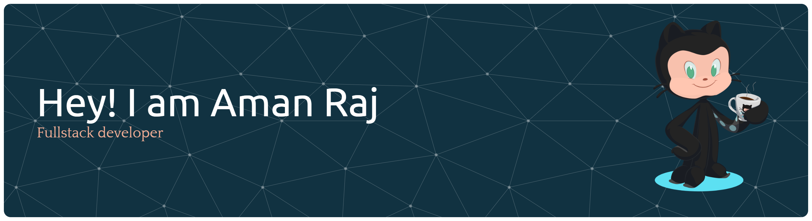

  

<h1 align="center">Hi there, I'm Aman Raj👋</h1>

  <strong>🚀 Full-Stack Developer | 💻 Problem Solver | 🎓 Lifelong Learner</strong>

---

### ⚡ About Me
I am a software developer who believes that technology is a tool to amplify human potential. I thrive on building systems that are not just functional, but clear and scalable.

* 🛠️ **Current Projects:** Building AI-driven media tools and performance analytics dashboards.
* 💎 **Philosophy:** I value **clarity**, **ownership**, and the relentless pursuit of **continuous improvement**.
* 📍 **Based In:** Chandigarh, India.

---

### 💡 Perspective

> **The Reality:** Not every project you build will change the world.  
> **The Truth:** Every "failed" deployment is a masterclass in what *not* to do. It’s the friction of failure that polishes the diamond of success.

---

### 🚀 Tech Stack

| Domain | Tools |
| :--- | :--- |
| **Frontend** | `React.js` `Tailwind CSS` `Redux` |
| **Backend** | `Node.js` `Express.js` `Hugging Face API` |
| **Databases** | `MongoDB` `PostgreSQL` |
| **DevOps** | `Cloudinary` `Git/GitHub` `Docker` |

---

### 📊 GitHub Insights

  
  

  

---

### 🏆 Achievements
* 🎓 **B.Tech in Computer Science** (2023 - 2027)
* 🛠️ Developed an **AI Thumbnail Generator** & **Interview Dashboard**

---

### 📫 Let's Connect

  
  

 

  

